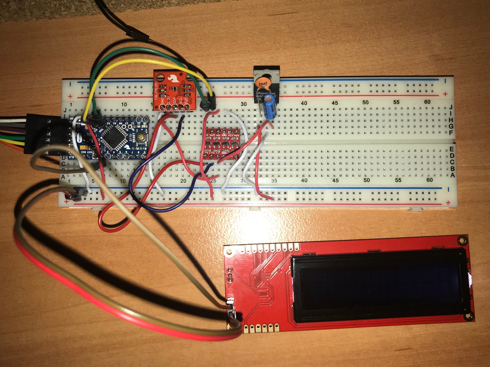
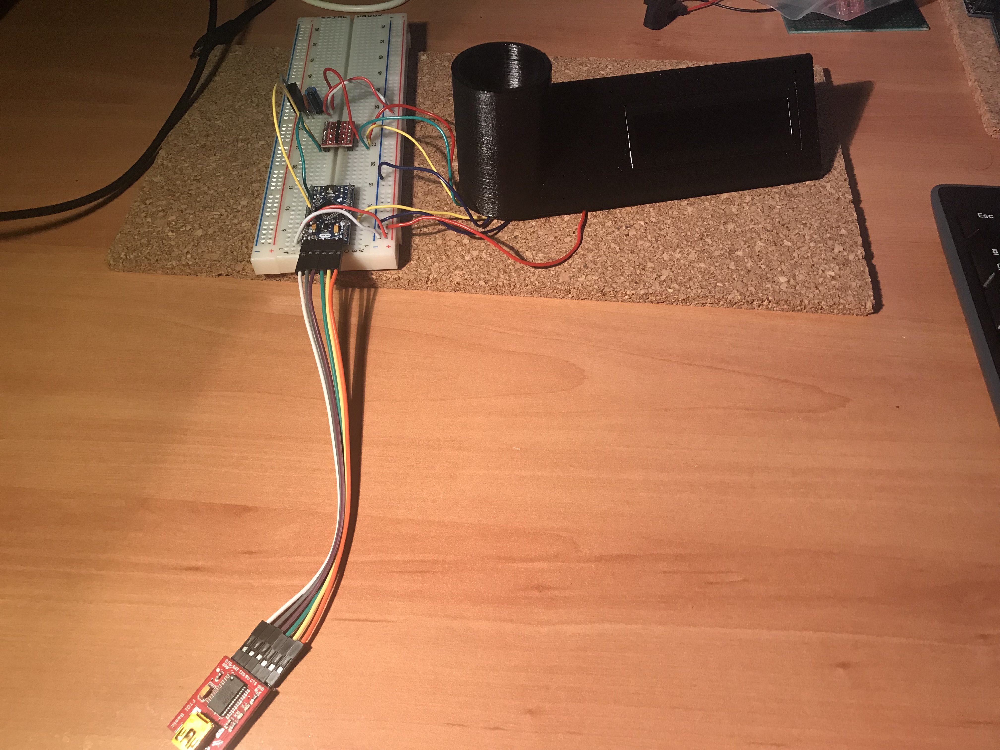
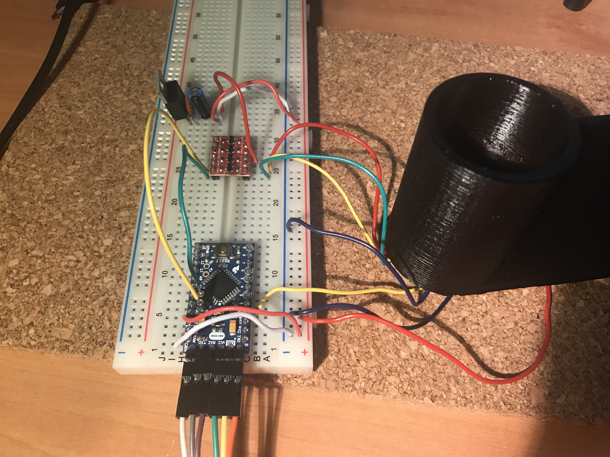
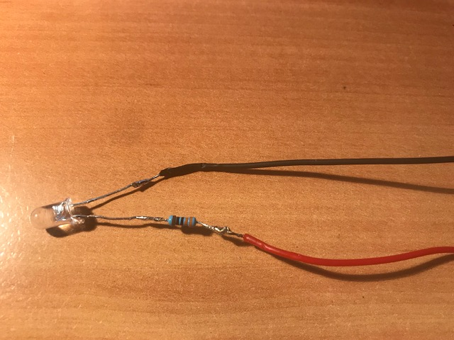
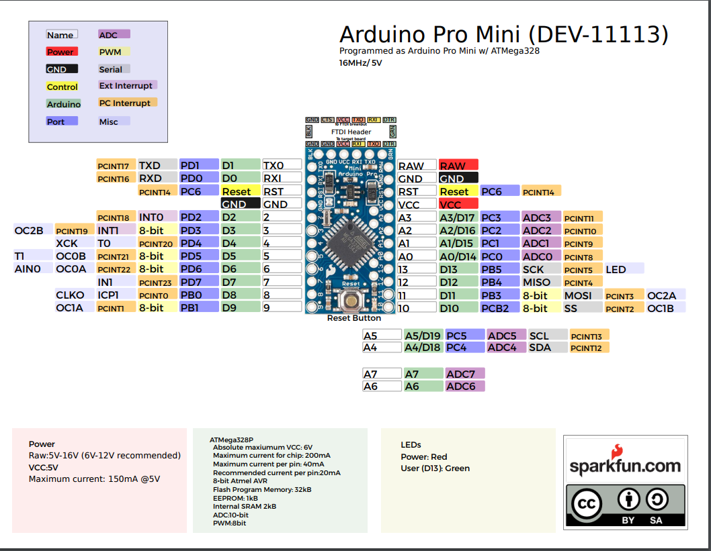

# Nespresso Arduino Pro Mini
Este proyecto es una copia del publicado en https://www.instructables.com/id/DIY-Nespresso-Capsule-Detector/ 

Hecho para pasar el tiempo y porque cuando tienes las capsulas sueltas al final no sabes la intensidad del café. Sinceramente la razón principal es la primera. :D Enjoy! 

Nota: Sacrilegio usar leche con el café.

# Material usado 
* Arduino Pro Mini 328 - 5V/16MHz
* Serial Enabled 16x2 LCD - White on Black 5V
* SparkFun RGB Light Sensor - ISL29125
* Logic Level Converter Bi-Directional SparkFun
* SparkFun FTDI Basic Breakout - 5V
* DC Barrel Jack Adapter
* LD1117 voltage regulator 3.3v. Ellos recomiendan este, yo he puesto LM3940IT. Cuidado con las patas, son diferentes
* Capacitor Ceramic 0.1uF
* Electrolytic Decoupling Capacitor - 10uF/25V
* cablecitos y demás...

# Modificación circuito
Se realiza modificación del circuito con respecto al que planteaban los de Instructables, puesto que se producía un corto.
Se sube la foto del circuito, cicuito.jpg.

# Conexiones
## LCD 2x16
    GDN LCD --> GND Arduino
    Vcc LCD --> Vcc Arduino
    RX  LCD --> Pin 2 Arduino

### Sensor RGB ISL29125 
    GND (azul) SensorRGB      --> GND Arduino

    Vcc (rojo) SensorRGB 3.3v --> LV de LogicLevelConverter LV

    SDA (verde) SensorRGB     --> LV1 de LogicLevelConverter

    SCL (amarillo) SensorRGB  --> LV2 de LogicLevelConverter

Nota: Los colores indicados en esta parte no coinciden con la imagen.
### LogicLevelConverter HV
    LogicLevelConverter HV1 --> A4 ArduinoProMini5v
    LogicLevelConverter HV2 --> A5 ArduinoProMini5v
    LogicLevelConverter HV  --> Vcc
    LogicLevelConverter GDN --> GDN
    LogicLevelConverter LV2 --> SCL SensorRGB
    LogicLevelConverter LV1 --> SDA SensorRGB
    LogicLevelConverter LV  --> Vcc SensorRGB y Salida 3v del  Connect LD11173.3v
### Connect LM3940IT
**Nota: LD11173.3v Ellos recomiendan este y las patas son diferentes GDN, Vout, Vin.                https://www.sparkfun.com/datasheets/Components/LD1117V33.pdf

LM3940IT: http://www.ti.com/lit/ds/symlink/lm3940.pdf
    Con la parta plana hacia atrás, Vin 5v, Gdn, Vout 3.3v
    
    
## LCD y SensorRGB en caja impresa en 3D
Es muy importante que el color de la impresión sea negra para que no deje pasar la luz. Usar filamento translúcido.

## Led blanco
Se añade un led blanco con resistencia de 330k para iluminar la cápsula.

## Arduino pro-mini

